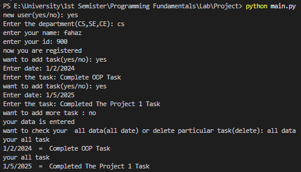

# 📋 Employee Task Management System (CLI)
### Programming Fundamentals | University Milestone Project

## 📱 System Preview


This project is a terminal-based Task Management System built to simulate how a company manages employee assignments across multiple departments (**Computer Science, Software Engineering, and Computer Engineering**). 

It was developed as a core project for my **Programming Fundamentals** course to demonstrate proficiency in data structures and logical flow.

---

## 🚀 Key Features
- **Departmental Filtering:** Logical separation of users into CS, SE, and CE categories.
- **User Registration:** Dynamic creation of unique user keys (Username + ID) stored in nested dictionaries.
- **Full CRUD Operations:**
  - **Create:** Add new tasks with specific dates.
  - **Read:** Check current tasks, specific dates, or view the entire task history.
  - **Update:** Change existing task descriptions or reschedule dates.
  - **Delete:** Remove completed or obsolete tasks.
- **Real-time Date Tracking:** Integration with the `time` module to identify tasks due today.

---

## 🛠️ Technical Logic
The system's "Database" is built using a **Nested Dictionary** structure:
```python
# Logic Blueprint
department = {
    "CS": {
        "userID": {"date": "task_description"}
    }
}
```
This allows for $O(1)$ lookup time for user data and ensures that task lists are isolated to specific employees.

---

## ⚙️ How to Run
1. Ensure you have **Python 3.x** installed.
2. Clone the repository:
   
   ```bash
   git clone https://github.com/SHADOWRULIN/Employee-Task-Management-CLI.git
   ```
3. Run the script:
   
   ```bash
   python main.py
   ```

---

## 📈 Learning Outcomes
- Implementing **Infinite Loops** for session management.
- Managing data persistence during runtime using **Dictionaries**.
- Developing modular code using **Functions** for specific tasks (Add/Delete/Search).

---

## 👤 Author
**Muhammad Fahaz Khan**
*CS Undergraduate at UIT University*

- **GitHub:** [@SHADOWRULIN](https://github.com/SHADOWRULIN)
- **LinkedIn:** [Fahaz Khan](https://www.linkedin.com/in/muhammad-fahaz-khan-85b805293/)

---

## 📄 License

This project is licensed under the **MIT License**.
